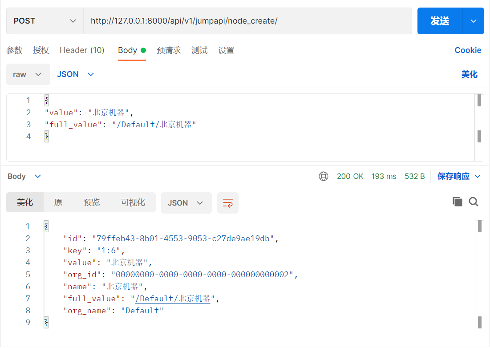
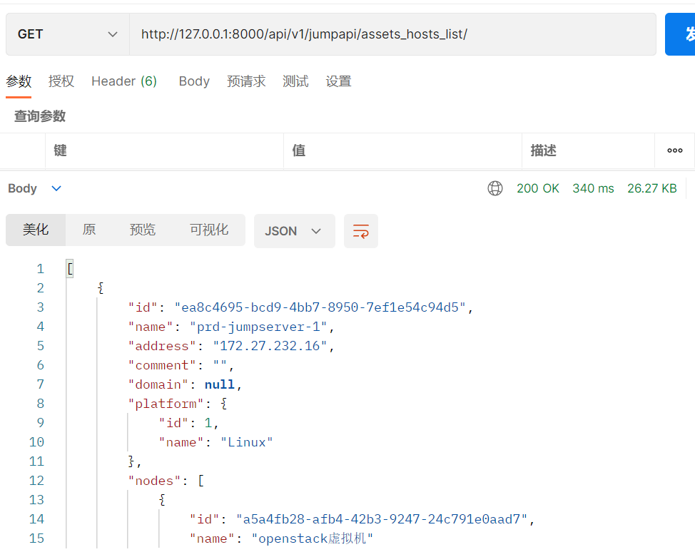
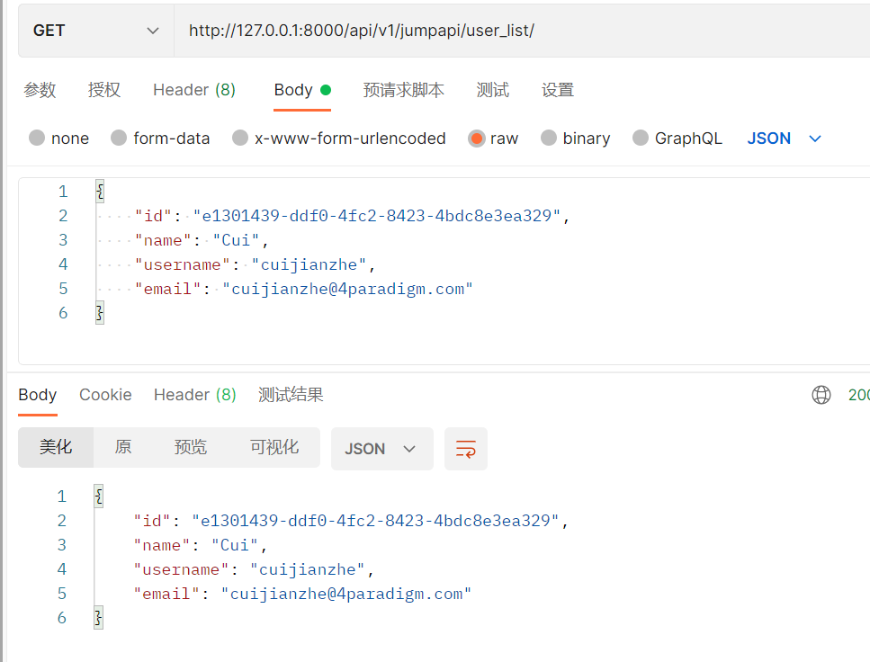
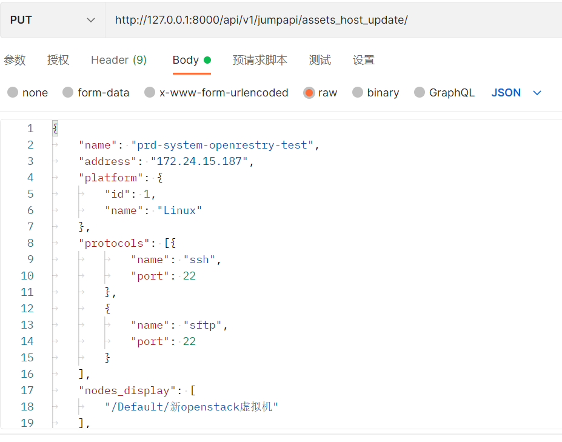
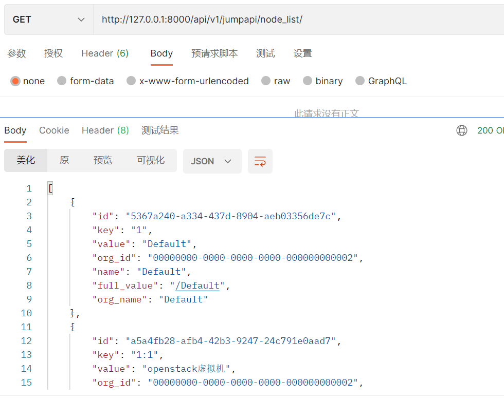
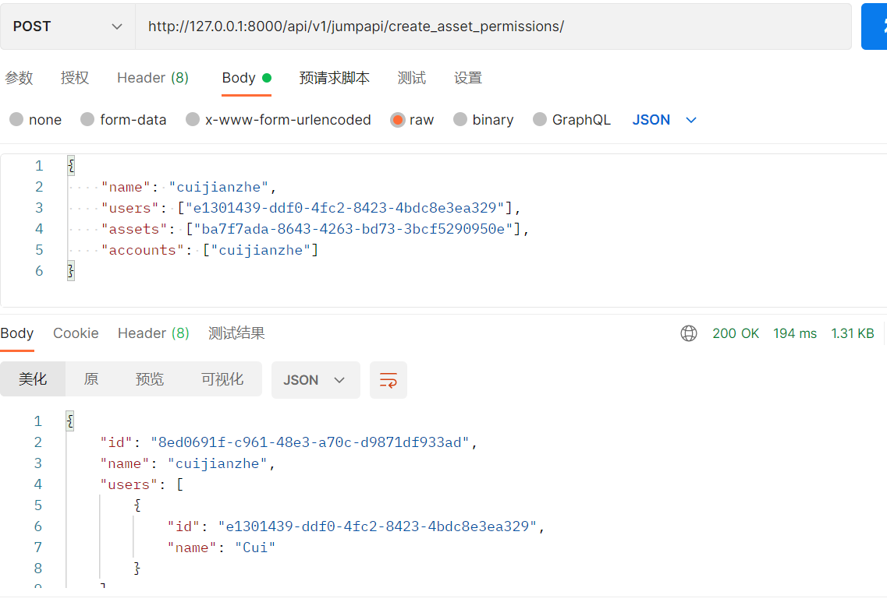
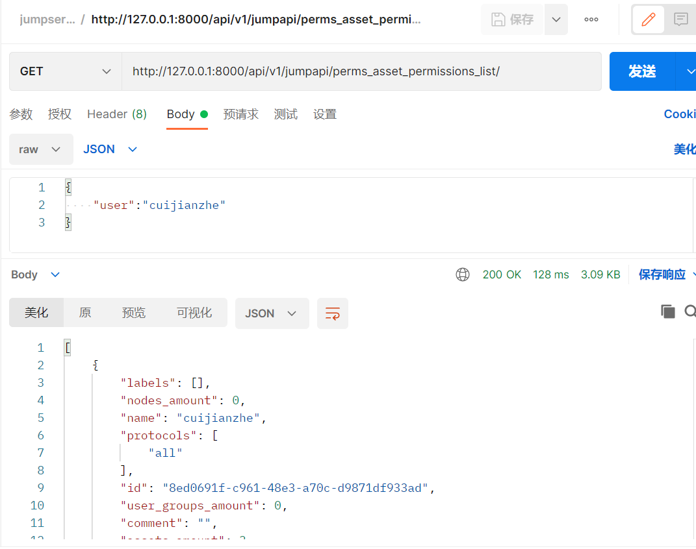

# README

　　Django封装jumpserver接口

　　请求示例：（[127.0.0.1:8000/api/v1/jumpapi/node_list](http://127.0.0.1:8000/api/v1/jumpapi/node_list/)）

* 创建node节点

​​

* 获取资产host列表：

​​

* 获取存在的用户信息：

​​

* 更新hosts资产信息：

​​

* 获取节点列表：

​​

* 创建授权规则：

​​

* 获取关联用户的授权规则

​​
